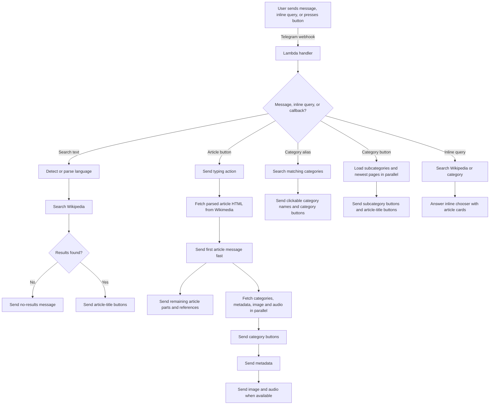

# Telegram Wikipedia Bot

Public Telegram bot for searching Wikipedia, using Telegram inline mode,
opening articles from inline buttons, splitting large articles across Telegram
messages, and returning metadata/media after the article body.

Code provenance: generated with an LLM, GPT-5.5 xhigh.

## Features

- Search Wikipedia by message text and return article-title buttons.
- Support Telegram inline mode: type the bot username and a query in any chat to
  insert a clickable Wikipedia article card with a short snippet.
- Infer common scripts automatically: Georgian, Cyrillic, Greek, Hebrew, Arabic,
  Armenian, Japanese, Korean, Chinese, Hindi, and Thai. Latin text uses
  `DEFAULT_WIKI_LANGUAGE`.
- Force a wiki with `lang:<code> query`, for example `lang:fr Albert Camus`.
- Fetch article text with the infobox at the top when Wikipedia exposes an
  `infobox` table in parsed HTML.
- Send the first useful infobox image directly from the parsed article HTML when
  Wikipedia exposes one.
- Render article and metadata headers in bold. Article section headers link to
  their Wikipedia section anchors.
- Preserve normal clickable internal Wikipedia links inside the article body.
- Preserve inline code and blockquote formatting when Wikipedia exposes those
  elements in parsed HTML.
- Render ordinary article tables as pipe-separated rows with links preserved.
- Detect disambiguation pages and show target-article buttons instead of dumping
  the disambiguation page body.
- Send references as a separate message after the article body, with extracted
  URLs printed visibly under each citation.
- Split articles into multiple Telegram messages under `TELEGRAM_MESSAGE_CHAR_LIMIT`.
- Attach clickable category buttons at the end of article output.
- Load newest article pages in a category from inline category buttons. Category
  buttons are Telegram callbacks, not external category links.
- Return article links from navigation templates as callback buttons when
  MediaWiki exposes `navbox`/sidebar navigation markup. The message title uses
  the navigation-template name when MediaWiki exposes it.
- Configure favorite category buttons through Lambda environment.
- Send `typing`, `upload_photo`, and `upload_voice` chat actions.
- Return metadata after the article: page info, clickable Wikidata and
  Wikimedia Commons, coordinates, 30-day pageviews, language-link count,
  external links, and clickable last edits/usernames with timestamps and edit
  summaries.
- Send a lead image and first detected audio file when Wikipedia exposes usable
  media URLs.
- Keep a bounded local RAM cache inside warm Lambda execution environments for
  searches, category listings, article content, metadata, categories, and media.
  There is no TTL; entries live until the warm Lambda environment is recycled or
  a cache namespace hits `RAM_CACHE_MAX_ENTRIES`.

Telegram's official Bot API does not document arbitrary button colors, but this
project follows the existing local YouTube bot convention and adds
`"style": "danger"` to buttons for articles whose MediaWiki size is at or above
`BIG_ARTICLE_CHAR_THRESHOLD`. It also adds `"style": "primary"` for very small
articles and for category result lists that contain exactly one article.

## Commands

- `/start` or `/help` shows usage and favorite category buttons.
- Inline mode: type `@<bot_username> Batumi railway station` in any Telegram
  chat to insert a clickable Wikipedia article card with a snippet.
- `/category en:Physics` searches matching English categories. Press a category
  button to return subcategory buttons and newest article pages added to that
  category.
- `Category:Physics`, `Category: Physics`, `Category Physics`, and `c Physics`
  search matching English categories when the default language is English.
- `Категория Физика`, `Категория:Физика`, and `к Физика` search matching
  Russian categories.
- `Катэгорыя Навука`, `Катэгорыя:Навука`, and `к be:Навука` search matching
  Belarusian categories. `к Фізіка` is also detected as Belarusian because it
  contains Belarusian-specific letters.
- `lang:ka თბილისი` searches Georgian Wikipedia explicitly.
- `თბილისი` searches Georgian Wikipedia through script detection.

## Flowchart



## Similar Bots

These are useful reference points, not dependencies of this project.

| Project | Language | Notes |
| --- | --- | --- |
| [1999AZZAR/wikipedia-powered-telegram-bot](https://github.com/1999AZZAR/wikipedia-powered-telegram-bot) | Python | Simple query-to-summary bot with translation support. |
| [NimaCodez/Wikipedia-Page-Finder](https://github.com/NimaCodez/Wikipedia-Page-Finder) | TypeScript | Telegram bot for quickly sending Wikipedia page links. |
| [themagicalmammal/wikibot](https://github.com/themagicalmammal/wikibot) | Python | Wikipedia feature bot with summaries, title search, and location-related commands. |
| [jhsoby/telegram-wikilinksbot](https://github.com/jhsoby/telegram-wikilinksbot) | Python | Wikimedia bot that links wiki links, Wikidata entities, Commons media entities, and Phabricator tasks in chats. |

## Configuration

Required Lambda environment:

- `TELEGRAM_BOT_TOKEN`
- `TELEGRAM_WEBHOOK_SECRET`

Optional Lambda environment:

- `ALLOWED_TELEGRAM_USER_IDS`: comma-separated numeric user IDs. Empty means the
  public bot is open to everyone.
- `DEFAULT_WIKI_LANGUAGE`: default `en`.
- `FAVORITE_CATEGORIES`: comma-, pipe-, or newline-separated entries. Entries may
  be `lang:Category title`; examples: `en:Physics|ka:თბილისი`.
- `SEARCH_LIMIT`: default `20`, capped to `20`.
- `TELEGRAM_MESSAGE_CHAR_LIMIT`: default `3900`.
- `BIG_ARTICLE_CHAR_THRESHOLD`: default `3900`.
- `SMALL_ARTICLE_CHAR_THRESHOLD`: default `1000`.
- `METADATA_REVISION_LIMIT`: default `10`, capped to `50`.
- `WIKIPEDIA_HTTP_TIMEOUT_SECONDS`: default `20`.
- `RAM_CACHE_MAX_ENTRIES`: default `512` entries per cache namespace. Set `0`
  to disable local RAM cache.

## Build

```bash
cargo fmt --check
cargo clippy --locked --all-targets --all-features -- -D warnings
cargo test --locked --all-targets
./scripts/build-lambda.sh
```

The build script targets AWS Lambda ARM64 with `RUST_TARGET_CPU=neoverse-n1` by
default and writes `build/lambda.zip`.

## Deploy

Terraform defaults to `us-east-1`, `3008` MB memory, `10240` MB ephemeral
storage, and a `900` second timeout. `us-east-1` is the closest normal AWS
Lambda region to Wikimedia `eqiad` (Ashburn, Virginia). Wikimedia core
application services are served from `eqiad` and `codfw`; if Wikimedia traffic
routing changes for your users, override `aws_region` in Terraform.

This AWS account currently rejects Lambda memory above `3008` MB in `us-east-1`.
If AWS raises the account/region limit to the newer `10240` MB maximum, set
`memory_size_mb = 10240` for more CPU.

```bash
./scripts/build-lambda.sh
cd infra
terraform init
terraform apply
```

Then register the Telegram webhook:

```bash
TELEGRAM_BOT_TOKEN=... \
TELEGRAM_WEBHOOK_SECRET=... \
FUNCTION_URL="$(terraform -chdir=infra output -raw function_url)" \
./scripts/set-webhook.sh
```

Inline mode also must be enabled in BotFather with `/setinline` for this bot.

Inspect logs:

```bash
PROJECT_NAME=telegram-wikipedia-bot AWS_REGION=us-east-1 ./scripts/show-logs.sh
```
